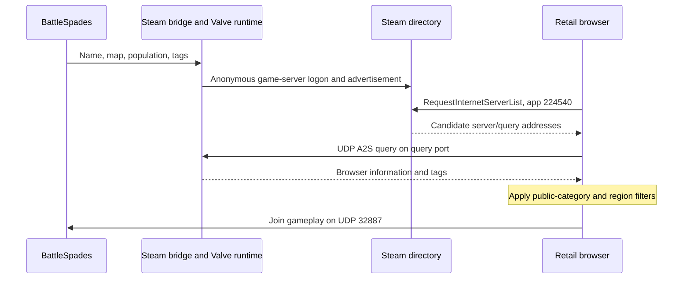

# Steam discovery for the retail Ace of Spades client

**VPS follow-up:** The existing Hetzner TDM server is now registered and
externally reachable at `204.168.157.43:32887`, with Steam queries on 32888.
See [the Linux deployment and verification record](STEAM_VPS_2026-09-21.md).
The Windows findings below describe the earlier local trial.

The Windows BattleSpades registration bridge was tested successfully on
2026-09-20. A separate, confirmed bug was fixed: its browser tag used the
gameplay mode ID where the retail client expects a **server category**.

## How discovery works



The directory does not discover a running ENet server by scanning the
Internet. The server must advertise itself, remain connected to Steam, answer
the browser's queries, and pass the client's filters. Valve documents the
[Game Servers API](https://partner.steamgames.com/doc/features/multiplayer/game_servers),
[anonymous logon and advertisement methods](https://partner.steamgames.com/doc/api/ISteamGameServer),
and [browser requests](https://partner.steamgames.com/doc/api/ISteamMatchmakingServers).

BattleSpades already implements the server half in `server/steam_master.py`
and `tools/steam_bridge/steam_bridge.cpp`. A separate Win32 helper loads the
operator's original x86 `steam_api.dll` and a compatible Steam client runtime.
This keeps the legacy ABI and callbacks outside the 64-bit simulation process.
It sets product `aos`, game directory `aceofspades`, description
`Ace of Spades`, dedicated status, map/name/tags, enables heartbeats, and calls
`LogOnAnonymous`. The isolated helper uses AppID `224540`, not Spacewar `480`.
No publisher key, game-server login token, or user password was supplied in
the successful registration test.

## The confirmed browser-filter bug

The actual installed retail `shared.steam.pyd` was examined and its native
filter called directly without patching it:

- SHA-256: `F020BE0D14AC6D0DB6F868727B197D4516E8CE7DE915BADC49F100B26F825CB4`
- Internet request: RVA `0x22FD0`, AppID `224540`, `gamedir=aceofspades`.
- Official request: RVA `0x230A0`, additionally `white=1`.
- User request: RVA `0x23220`, additionally `nand(white=1)`.
- Row acceptance: RVA `0x24690`, checks app, category and optional region.
- Category filter: RVA `0x2320`, tests `SERVERMODE_*` bits against
  `mode=%04d` strings. The special request mask 15 accepts all categories.
- The retail `ServerMenu` passes `SERVERMODE_PUBLIC=1` for its Internet list.

| Tag passed to original native filter with request mask 1 | Result |
| --- | --- |
| `v168;playlist=8;mode=0001` | Accepted |
| `v168;playlist=8;mode=0006` | Rejected |
| `v168;playlist=8;mode=0008` | Rejected |

The category constants are public=1, ranked=2, tutorial=4, custom=8,
monitor=16. They are independent of gameplay IDs such as TDM=6 and CTF=8.
Before this fix, `build_game_tags` used `mode.mode_id`. It now advertises
public category `mode=0001` for the public dedicated server. Gameplay stays
in the map prefix (`TDM_MayanJungle`, for example) and session packets.
Classic/mafia tags are preserved.

This corrects the earlier AGEX assessment: their `mode=0001` versus TDM
session ID 6 is **correct**, not an inconsistent TDM label or an age marker.
Their query-port behavior and Valve registry membership are consistent with
the normal Steam GameServer registration mechanism. Network responses cannot
identify their exact library version or implementation.

## What was verified on this Windows machine

The first four-minute trial registered with Steam and answered local queries.
After the category fix, a second bounded run verified the corrected wire tag.
Valve's public [GetServersAtAddress endpoint](https://partner.steamgames.com/doc/webapi/ISteamApps#GetServersAtAddress)
returned the second run with:

| Field | Observed value |
| --- | --- |
| Query address | `149.62.204.25:32888` |
| Game port | `32887` |
| Steam server ID | `90293114461913118` |
| AppID / directory | `224540` / `aceofspades` |
| LAN / secure | false / false |
| Local query name | `BattleSpades - Retail Test` |
| Local query map | `TDM_MayanJungle` |
| Local query tags | `v168;playlist=8;region=europe;mode=0001` |

These addresses/IDs describe a temporary run, not a promised persistent
endpoint. Anonymous server IDs and the home public IP can change.

The signed original Valve DLL passed Windows signature validation. The x86
helper built successfully. The focused test suite passed: 22 tests.

Public reachability remains unverified. The loopback query succeeded; a query
from this same PC to the public IP timed out. That can reflect missing port
forwarding, filtering, or lack of NAT loopback, so it is not a definitive
external-network test. The PC's Ethernet address was `192.168.1.9`, gateway
`192.168.1.1`. Windows UPnP exposed no mapping collection, and the operator
reported no router access / uncertainty about forwarding.

A standalone client-side browser probe failed at `SteamAPI_Init`; no valid
Internet-list request was started. Its zero rows are **not** a measured empty
directory. End-to-end appearance in an unmodified retail UI and an external
game join were not established in this run.

The old hostname `hl2master.steampowered.com` did not resolve, but the native
wrapper calls Steam's matchmaking interface. DNS failure of that hostname
alone does not prove failure of the current runtime's transport. Earlier
notes making that inference have been corrected.

## Run the prepared Windows configuration

The local-only, git-ignored `config.steam-local.toml` preserves the usual
configuration in `config.toml`. It enables the Steam bridge, sets gameplay
port 32887 and query port 32888, selects the installed Valve runtime, and
uses region `europe`. The separate Revival web advertisement is disabled for
this test profile. It also has a generated local admin password rather than
the development default. Do not publish the machine-specific config.

From the BattleSpades repository:

```powershell
cmake --build build/steam-bridge --config Release --parallel
py -3.12 run_server.py --config config.steam-local.toml
```

Use Ctrl+C to stop a foreground run. Healthy logs contain
`Steam GameServer011 initialized` and
`Steam master logon complete: steam_id=...`. Registration disappears after
shutdown/backend expiry; neither the config file nor the registry query
creates a permanent listing.

For a fresh Windows checkout, configure the helper first with
`cmake -S tools/steam_bridge -B build/steam-bridge -A Win32` and provide an
operator-owned Valve runtime. See the Steam section of `RUNBOOK.md` for a
portable configuration. The repository does not redistribute Valve DLLs.

## Complete the public path

The router administrator needs to forward these UDP ports to this PC:

| External UDP port | Internal destination | Purpose |
| --- | --- | --- |
| 32887 | `192.168.1.9:32887` | Game traffic; stock browser hardcodes this port |
| 32888 | `192.168.1.9:32888` | Steam-owned browser query traffic |

Reserve the PC's LAN address so those rules stay valid. Permit matching
traffic through Windows Firewall. The configured legacy Steam port is 8766;
backend connectivity also needs to remain allowed. The tested runtime logged
on successfully without a listener on local UDP 8766, so a guessed 8766 rule
is not a substitute for testing the two actual game/query listeners.

From a genuinely different network, while the server runs:

```powershell
py scripts/check_steam_registration.py YOUR_PUBLIC_IP --game-port 32887 --query-port 32888
```

Then refresh the retail Internet All/User list with the appropriate region
and empty-server visibility. Community servers belong in All/User; no
official whitelist flag is needed. Finally, join from that external client.
The original `ServerInfo` hardcodes port 32887 even if a different game port
is returned, so multiple stock-joinable instances need suitable separate
public addresses or a client that honors the returned port.

If router access is unavailable, a reachable public host or a carefully
configured UDP relay is needed. A generic HTTP tunnel does not carry this
traffic. A game-only UDP tunnel is also insufficient if Steam advertises a
different public address; registration and game/query endpoints must agree.
No router settings, VPN routes, Steam account settings, or hosting purchases
were changed during this investigation.

Local evidence is in `tmp/steam-discovery-20260920/`: original/fixed Valve
registry responses, `fixed-local-query.json`, `native-filter-results.json`,
`native-filter.log`, and the bounded trial's console log. The focused source
changes are in `server/steam_master.py` and `tests/test_steam_master.py`.
